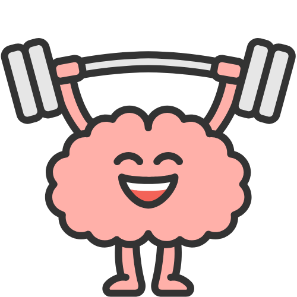

<div align="center">
  
  
  # 🧠 Brain Gym
  
  ### Neuroscience Backed Brain Exercises
  
  *Cognitive Training Platform for Enhanced Mental Performance*
  
  [](https://sameer-goel.github.io/BrainTrain/BrainGym/)
  [](https://sameer-goel.github.io/BrainTrain/BrainGym/)
  [](https://developer.mozilla.org/en-US/docs/Web/HTML)
  [](https://developer.mozilla.org/en-US/docs/Web/CSS)
  [](https://developer.mozilla.org/en-US/docs/Web/JavaScript)
  
  ---
  
  **🎯 [Try Brain Gym Live →](https://sameer-goel.github.io/BrainTrain/BrainGym/)**
  
</div>

## 🎯 Vision & Mission

### 🚨 **The Problem We're Solving**
In the age of mindless scrolling and AI dependency:
- 📉 **Attention spans** have declined by 8% globally
- 🧠 **Critical thinking** is rapidly deteriorating 
- 🔄 **Task-switching** abilities are compromised
- 💭 **Deep analytical reasoning** is becoming rare
- ⏰ **Sustained focus** is increasingly difficult

### 🎮 **Our Solution**
**Gamified learning backed by neuroscience** - Where employees play engaging brain games, get personalized brain scores, and receive targeted exercises to improve cognitive performance.

### 🌟 **Core Philosophy**
*"Train Your Mind, Unlock Your Potential"* - Combining validated neuroscience research with modern gamification to create an engaging cognitive training experience.

## 🧠 Brain Exercise Categories

### 🎯 **Focus**
*Improve attention and concentration*
- Target sustained attention deficits
- Combat mindless scrolling effects
- Build concentration endurance

### 🧠 **Memory** 
*Enhance recall and retention abilities*
- Strengthen working memory capacity
- Improve information processing
- Build cognitive load tolerance

### 🧩 **Logic**
*Sharpen reasoning and problem-solving*
- Develop analytical thinking skills
- Enhance pattern recognition
- Build systematic reasoning

### 🎵 **Music**
*Train auditory skills and rhythm*
- Improve auditory processing
- Enhance temporal sequencing
- Build rhythmic cognition

### 🔢 **Maths**
*Boost numerical and quantitative skills*
- Strengthen numerical reasoning
- Improve calculation speed
- Build mathematical intuition

### 📚 **Language**
*Expand vocabulary and verbal skills*
- Enhance verbal fluency
- Improve comprehension speed
- Build linguistic processing

### 🎲 **Problem Solving**
*Apply strategic thinking to challenges*
- Develop multi-step planning
- Enhance strategic thinking
- Build solution-finding skills

### ❤️ **Emotional Intelligence**
*Develop emotional awareness and empathy*
- Improve emotional recognition
- Build empathy and social cognition
- Enhance interpersonal skills

## ✨ Features

### 🎨 **Beautiful Neural Network UI**
- **Dark Futuristic Theme** with glassmorphism effects
- **Custom Brain Gym Logo** with neural network design
- **Animated Light Sweep** under the main title
- **Responsive Design** that works on all devices

### 👤 **User Profile System**
- **Interactive Profile Toggle** - Click the Brain Gym logo in top-right corner
- **Progress Tracking** with visual statistics (78% average score, 45 sessions)
- **Recent Activity** monitoring (Focus Training, Memory Challenge, Logic Puzzle)
- **Achievement Badges** system (🏆🎯🧠🔒)
- **Glassmorphism Sidebar** with smooth animations

### 📊 **Mock Data Integration**
- Comprehensive user profiles (Sameer Goel - AI Architect)
- Historical test results and progress tracking
- 6 months of progress simulation
- Realistic usage patterns and analytics

## 🚀 Quick Start

### 🌐 Try Online (Recommended)
**👉 [Launch Brain Gym](https://sameer-goel.github.io/BrainTrain/BrainGym/) - No installation required!**

### 💻 Run Locally
```bash
# Clone the repository
git clone https://github.com/sameer-goel/BrainTrain.git

# Navigate to the project
cd BrainTrain

# Open in your browser
open BrainGym/index.html
# or serve with Python
python -m http.server 8000  # Then visit http://localhost:8000/BrainGym/
```

## 🎮 How to Use

1. **🌐 Visit the Live Demo** at [sameer-goel.github.io/BrainTrain/BrainGym](https://sameer-goel.github.io/BrainTrain/BrainGym/)
2. **👤 Click the Brain Gym logo** in the top-right corner to open your profile
3. **📊 View your progress** - 78% average score, 45 sessions completed, +23% growth
4. **🏆 Check achievements** - Earned badges and locked challenges
5. **🎯 Choose a brain exercise** from the 8 available categories
6. **🧠 Start training** your cognitive abilities!

## 🛠️ Technology Stack

- **Frontend:** Pure HTML5, CSS3, Vanilla JavaScript
- **Design:** Neural Network theme with glassmorphism effects
- **Icons:** Custom SVG designs and Feather icons
- **Animations:** CSS keyframes and transitions
- **Data:** JSON-based mock data system
- **Hosting:** GitHub Pages

## 🎯 Cognitive Tests (Coming Soon)

### 🔴 Stroop Test - "Color Clash"
Test cognitive inhibition and attention control by identifying colors while ignoring word meanings.
- **Addresses:** Cognitive control declining from mindless scrolling
- **Validation:** Most widely recognized cognitive test globally

### 🔵 N-Back Test - "Memory Chain"
Challenge working memory by remembering stimuli from N steps back in the sequence.
- **Addresses:** Attention span and working memory deficits
- **Validation:** Extensively validated for cognitive training research

### 🟢 CPT Test - "Focus Guardian"
Maintain sustained attention over time by responding to target stimuli while ignoring distractors.
- **Addresses:** 8% global attention span decline directly
- **Validation:** Specifically designed to measure attention degradation

## 🏗️ Project Structure

```
BrainTrain/
├── BrainGym/
│   ├── assets/           # SVG logos and images
│   │   ├── logo.svg      # Profile trigger logo (50x50)
│   │   ├── logo-large.svg # Sidebar logo (80x80)
│   │   └── logo-title.svg # Hero title logo (60x60)
│   ├── css/             # Stylesheets
│   │   ├── styles.css   # Base styles
│   │   └── variants.css # Neural Network theme
│   ├── js/              # JavaScript modules
│   │   ├── app.js       # Main application logic
│   │   ├── mockData.js  # Mock data and API
│   │   └── cognitiveTests.js # Test implementations
│   ├── index.html       # Main application
│   └── debug.html       # Debug version
├── Docs/               # Project documentation
└── README.md           # This file
```

## 🎨 Design Philosophy

Brain Gym uses a **Neural Network** inspired design that reflects the cognitive nature of the application:

- **🌌 Dark Theme** - Reduces eye strain during extended use
- **💙 Blue-Violet Gradients** - Represents neural connections and brain activity
- **✨ Glassmorphism Effects** - Modern, elegant visual style
- **🔄 Smooth Animations** - Enhances user experience without distraction
- **📱 Mobile-First** - Responsive design for all devices

## 🚧 Development Status

### ✅ Phase 1: UI/UX Design (Complete)
- [x] Neural Network theme implementation
- [x] Custom Brain Gym logo and branding
- [x] Profile toggle and sidebar functionality
- [x] 8 brain exercise categories
- [x] Mock data system
- [x] Responsive design

### 🔄 Phase 2: Cognitive Tests (In Progress)
- [ ] Stroop Test implementation
- [ ] N-Back Test implementation
- [ ] CPT Test implementation
- [ ] Scoring algorithms
- [ ] Results tracking

### 📋 Phase 3: Advanced Features (Planned)
- [ ] User authentication
- [ ] Progress analytics
- [ ] Personalized recommendations
- [ ] Social features
- [ ] Performance insights

## 🤝 Contributing

We welcome contributions! Here's how you can help:

1. **🍴 Fork** the repository
2. **🌿 Create** a feature branch (`git checkout -b feature/amazing-feature`)
3. **💾 Commit** your changes (`git commit -m 'Add amazing feature'`)
4. **📤 Push** to the branch (`git push origin feature/amazing-feature`)
5. **🔄 Open** a Pull Request

## 📄 License

This project is licensed under the MIT License - see the [LICENSE](LICENSE) file for details.

## 🙏 Acknowledgments

- **Neuroscience Research** - Based on validated cognitive assessment methods
- **Design Inspiration** - Modern glassmorphism and neural network aesthetics
- **Open Source Community** - Built with love using open web technologies

## 📞 Contact

**Sameer Goel** - [@sameer-goel](https://github.com/sameer-goel)

**Project Link:** [https://github.com/sameer-goel/BrainTrain](https://github.com/sameer-goel/BrainTrain)

**Live Demo:** [https://sameer-goel.github.io/BrainTrain/BrainGym/](https://sameer-goel.github.io/BrainTrain/BrainGym/)

---

<div align="center">
  
  **🧠 Train Your Mind, Unlock Your Potential 🧠**
  
  Made with ❤️ and ☕ by the Brain Gym Team
  
</div>